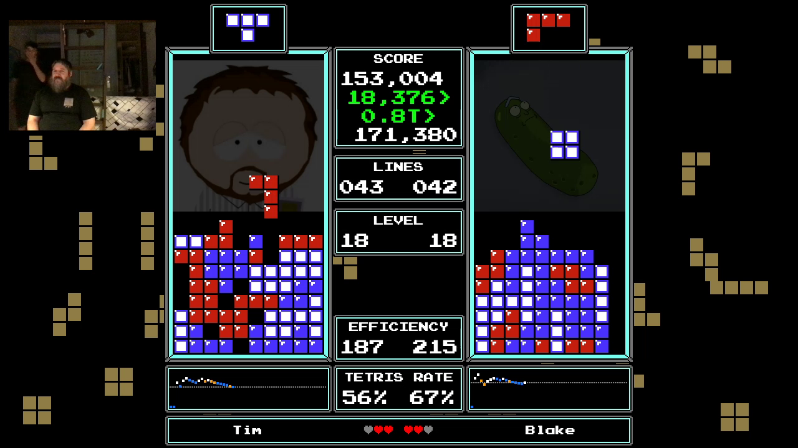
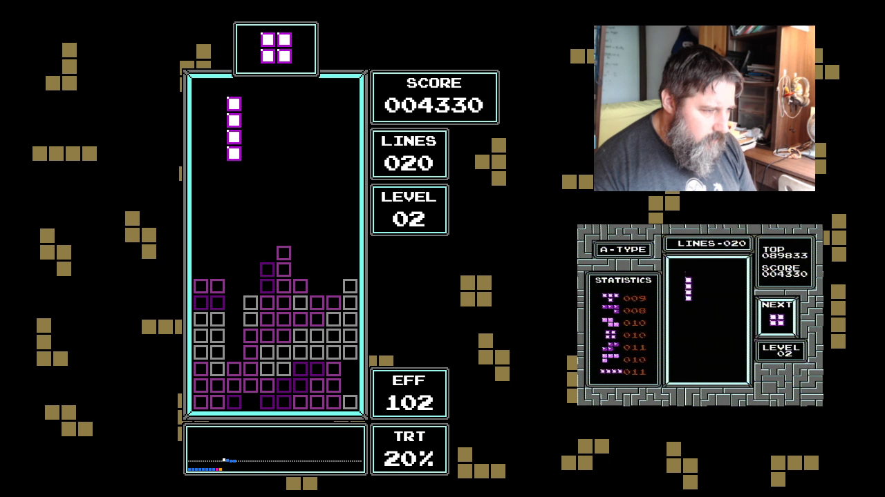

⚠️⚠️⚠️⚠️⚠️⚠️⚠️⚠️⚠️⚠️⚠️⚠️⚠️⚠️⚠️⚠️⚠️

This project is **obsolete**.

It has been superseeded by [NesTrisChamps](https://github.com/timotheeg/nestrischamps)

⚠️⚠️⚠️⚠️⚠️⚠️⚠️⚠️⚠️⚠️⚠️⚠️⚠️⚠️⚠️⚠️⚠️

## A Renderer for Classic NES Tetris

NesTrisStatsUI is a project to render NES Tetris. It runs by processing Tetris data reported by [NESTrisOCR](https://github.com/alex-ong/NESTrisOCR).

When we have Tetris data, the tetris game can be re-rendered with custom layouts, and various statistics can be computed. When multiple player data are used, a competition UI can be built with score differential, etc.

NEStrisStatsUI provides many templates implemented in HTML+CSS+JavaScript at 720p resolution. This allows the templates to be dropped easily in [OBS](https://obsproject.com/) or [StreamLabs](https://streamlabs.com/) as [browser sources](https://obsproject.com/wiki/Sources-Guide#browsersource), and then adding player video stream or other sources on top of it.

### Screenshots

#### Many stats for one player:

Documentation for sections of that UI is [here](./docs/stats.md)

1 game demo video [here](https://www.youtube.com/watch?v=OhNsuIUrRD0)

#### Competition Layout

Includes score differentials, difference in number of tetrises, tetris rate computation, and running tetris rate.

UI "inspired" from, and improving on, [CTJC's layout](https://www.youtube.com/watch?v=ATpW6TQ_H2c).

1 game demo video [here](https://www.youtube.com/watch?v=0cnpc64fveg)

#### Invisible Tetris Renderer

Here's a demo of my playing from the renderer itself (it's harder than it looks because rendering runs 2 frame behind)
* [Game 1](https://www.youtube.com/watch?v=eh2bqVe4wOo)
* [Game 2](https://www.youtube.com/watch?v=6CLdBgV3DW4)

The 2 semi finals and the final match of CTWC 2019's Invisible Tetris Competition have also been rendered with this renderer for demo, as seen from the links below:
* [Semi 1 - Joseph vs Kauser](https://www.youtube.com/watch?v=OXluTMkbGG4)
* [Semi 2 - GreenTea vs Alex](https://www.youtube.com/watch?v=JVHS3EaVAA4)
* [Final - Kauser vs Alex](https://www.youtube.com/watch?v=5nBTSb1zKjc)

## (Some) Features

* Historical game score tracking in local sqlite3 DB
* Connection to twitch channel to extract chat in real time, (optionally with voice)
* Connection to google voice or OSX `say` to speak chat entries
    * Voices are assigned randomly to a chat user and reused for that user for consistent conversation
* Lots of stats for the ongoing game:
	* Lines/Scores
	* Transition Score (first level change)
    * Tetris Rate / Burn counter
    * Efficiency
    * Running Tetris rate which indicate the singles/doubles/triples/tetris taken
    * Drought counter
    * Piece distribution with drought representation for all pieces
    * Occurence rates for Singles/Doubles/Tripes/Tetris (Last one being Tetris Rate)
    * Point tracking per SoftDrop/Single/Doubles/Triples/tetris with their percentage contribution to the total score
    * Height and state or board (Clean Slope, Tetris-ready, Double Well)

## Setup

### Dependencies

* git clone project
* `npm install`
* copy `config.example.js` to `config.js` and edit the values according to what you need

### Twitch

You need a twitch oauth token to be able to connect to chat. Get started [here](https://dev.twitch.tv/docs/irc)

### Google voice

To use Google Voice, you need a Google account and you need to export your google credentials as an environment variable before runnng the server.

### OCR

Install and configure [NESTrisOCR](https://github.com/alex-ong/NESTrisOCR) to capture your local Tetris gameplay (window for emulators, openCV preferably for NES video capture)

Notes:
* The current `NEStrisStatsUI` works with a custom fork of `NESTrisOCR` to support Das Trainer. That version is no yet public
* A version of `NEStrisStatsUI` to work with Vanilla `NESTrisOCR` is in the works

Make sure you configure NEsTrisOCR to send th

## Running

1. Run NESTrisStatsUI: `npm run start`
2. Run NesTrisOCR: `python3 main.py`
3. Open in Browser `http://localhost:3000/skin_das_trainer.html`

You should be able to verify see the tetris gaeplay being re-rendered

### OBS

The 2 layouts `skin_das_trainer.html` and `competition_layout1.html` are designed to be displayed at exacly `1280x720` (i.e. 720p).

In OBS:

1. set the canva size fo 1280x720
2. Add a browser component, at exactly 1280x720, make it load the resource `http://localhost:3000/skin_das_trainer.html`

If you have a webcam, set a video overlay to match the layout slot.

To run and stream, repeat the steps 1, and 2 above, but replace step 3 by

3. Run OBS

## Contribute

TODO

Note: This repo is built by myself for myself. Meaning it works, but setting up and troubleshooting is a pain, much of the code is copy/pasted between templates, and there's no documentation on the servers, ports, etc. At some point I will make it clean to allow people to use it easily, and to contribute to it easily, but there's no ETA for that.

## Bonus: Competition Layout

The project contains a competition layout where 2 OCR streams can be sent to individual ports and rerendered.

So far only the score differential, tetris rate and running tetris rate are supported for both players

## References

* Capture device: [EasierCap](https://www.amazon.com/Capture-Grabber-Recorder-Adapter-Converter/dp/B00STDO9PM)
