As of 2020-07-13, this is the view of the Stats UI

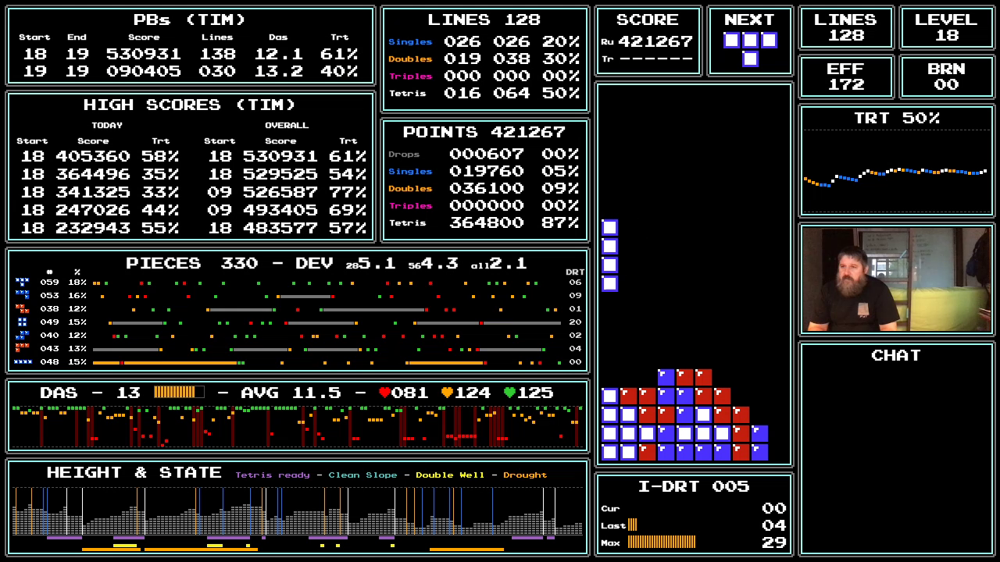

Many stats are self-explanatory, but nevertheless, this document will go over each.

## Background Info

The Stats UI runs for a given player (defaults to "TIM"). Each completed game is recorded in a local sqlite3 database for that user.

Any piece in Tetris can have a drought (a sequence of pieces where a given piece doesn't come out). In modern Tetrises with bags, the maximum sequence length for which a piece doesn't come is 12 (2 consecutive bags of 7 pieces, where a piece type is the first of the first bag, and the last of the second bag).

Below is one example of the longest possible T drought in modern tetrises:

```
Bag 1: T L I S O J Z
Bag 2: I S Z J O L T
````

In contrast, Classic NES tetris doesn't use bag rndomization. Because of that a drought may have any arbitrary length and be extermely dificult for a player to navigate. A player is considered in a drought in NES Classic Tetris whenever there is a sequence 13-long or more where a given piece does not come.

This stats UI shows droughts for all pieces to try to quantify whether a game was hard. Special attention is given to I-droughts of course, since only I pieces can give Tetrises.


### Color-coding

Various components of the statsUI show stats driven by line clear events, or include inormation about line clear events. These will be color coded as followed:

*  `#1678FF`  for Singles
*  `#FF9F00`  for Doubles
*  `#FF00B9` for Triples
*  `#FFFFFF` for Tetrises (i.e. White!)


## PBs

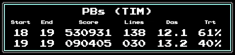

Level 18 and 19 start PBs for the current player (retrieved from DB).

PBs are reported on score alone, not on number of lines


## High Scores

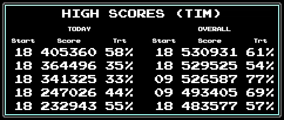

Reports the top 5 high scores for the current player in 2 sections:
* For the day
* Overall


## Lines

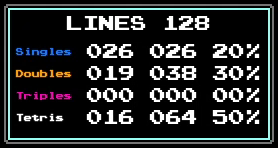

Shows stats about lines cleared, by type of line clears. Contains 4 type of information:

* total number of lines clear (as read from the game UI)
* for each type of line clear, shows:
    * number of line clear events for that type
    * number of lines cleared for that type
    * percentage of lines cleared for that type overall (Note: The percentage for tetrises is the "famous" tetris rate)


## Points

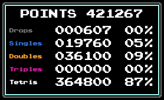

Shows point stats for the game in 3 types of information:

* current score for the whole game (as read from the game UI)
* For each point line clear type, shows the points generated and the percentage contribution of that type of line clear to the overall score
* Also shows points accumulated from soft drops (labelled "Drops")


## Pieces

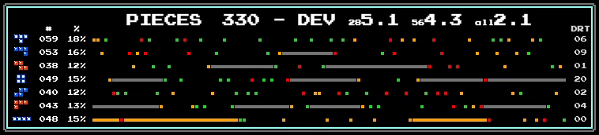

This section is a little crowded with information.

### Header


Shows:
* Number of pieces played in the game 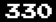
* "Eveneness" measurement for 3 game periods
    * Last 28 pieces (4 bags) 
    * Last 56 pieces (8 bags) 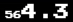
    * All game pieces 

Evenness is a metrics computed from this formula:

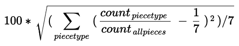

Which is almost identical to the [Standard Deviation](https://en.wikipedia.org/wiki/Standard_deviation), but uses ratios rather than piece counts.

### Notes on Evenness

* In modern tetrises, evenness for the *last 4 bags* and *last 8 bags* would be 0, since all pieces would have exactly a ratio of 1/7
* On a sufficiently long game, the evenness of *all game pieces* should also tend to zero, as the distribution for all pieces evens out.
* The 3 metric can each take values within the range 0 (all pieces came out with the same count) to 35 (only one piece came out from a given sequence)

As shown in the sample values below:

```javascript
// 28 pieces (4 bags), perfect evenness
evenness([4, 4, 4, 4, 4, 4, 4]); // 0

// 28 pieces (4 bags), okay-ish distribution
evenness([4, 6, 2, 1, 7, 5, 3]); // ~7.1

// 28 pieces (4 bags), worst possible distribution (only single piece released)
evenness([28, 0, 0, 0, 0, 0, 0]); // ~35.0

// 28 pieces (4 bags), very even ... except for a drought
evenness([0, 4, 5, 5, 4, 5, 5]); // ~6.0

```

Note that eveness does not convey precise information, it's only a general comparative measurement. As in a value of 2 wou;d tell you it's "pretty even", a value of 9 would tell you "something weird was happening", but you'd still have to inspect the distribution to know what.


### Distribution matrix

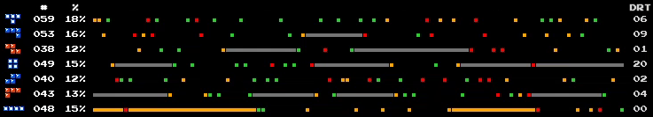

The second thing the piece section is the distribution matrix, which is crammed with information. There are 7 rows, one for each piece types, with the following information:

* Piece type label (colored based on the level)
* Number of piece released for that type
* Overall distribution of that piece in the game
* Visual representation for the piece distribution within a timeline of the last 120 pieces
    * Each dot represent a time when the piece was released
    * Dots are color coded based on the das value the piece had when it spawned (see section on das below)
    * If the piece experiences a drought, a continuous bar will be displayed (in grey for all piece types, but in orange for the I piece, because it is the most important drought type)
* Current drought counter for the piece

## DAS Section

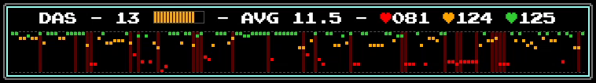

### Header

The following informations are presented:
* Instant Das value with gauge 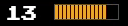
* Average Das value from when pieces spawned (newbies will get a number below 10, average player 10-12, experts above 14) 
* 3 counters 
    * Number of pieces where spawn DAS was below 10 and below (red heart)
    * Number of pieces where spawn DAS was between 10 and 14 (both inclusive) (orange heart)
    * Number of pieces where spawn DAS was 15 or 16

### Matrix

The second section represents a timeline of piece spawning (just like the matrix in the Piece section above). Each column represent one piece spanwing. Approximately the last 150 pieces are presented.

The matrix position color code the dots based on the das values see section Header above), and position the dots based on the value too (full das on top, empty das below). The result represents a "signature" of the player skills at controlling DAS.

Additionally, each time DAS is lost (falls to 0 when moving pieces, a dim red vertical bar is displayed).

#### Sample DAS signatures:

* Average DAS player (myself - losing was a lot)


* Expert Das player (my son Tristan - almost never losing das)

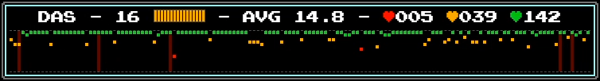


## Height and State

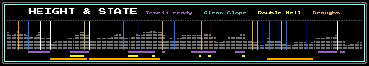

This section is yet another timeline. It is perfectly aligned with the DAS timeline above.

### Header

The header conly contains the color-coded legend of the information provided. 4 states are being tracked:
* Is board tetris-ready
* Is board in a perfect slope (decreasing or equal height from left to right)
* Is there a double-well (double well can only be true if player is also tetris ready)
* Is player in a I-piece drought

### Matrix

The timeline represents the height of the board at a specific point in time.

The State of the board is represented as 3 lines below

Each line clear event is represented as a vertical line of the color code for line that line-clear type.

Example with all 3 types of markers:

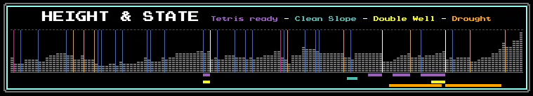


Sample board with their states:

| sample | sample | sample |
| :-: | :-: | :-: |
| 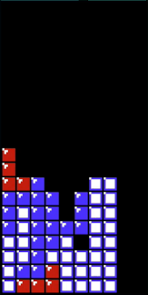 | 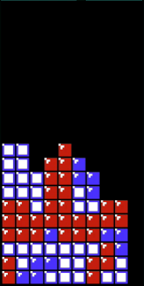 | 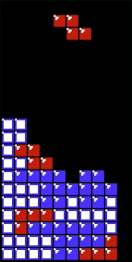 |
| **nothing** | Tetris Ready | Tetris Ready |
| 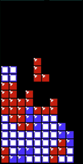 | 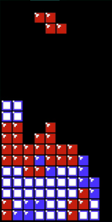 | 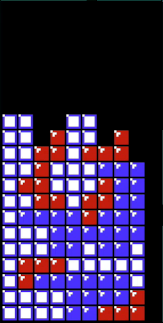 |
| Tetris Ready + Double Well | Tetris Ready + Double Well | Tetris Ready + Double Well |
|  | 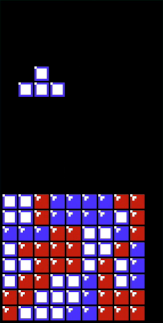 | 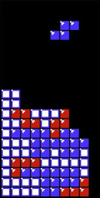 |
| Perfect Slope | Perfect Slope | Perfect Slope + Tetris Ready + Double Well |


### Interesting Notes

Observe the graph, you can see whether periods of tetris-readiness (purple horizontal marker) are ended with a Tetris (vertical white line)

You can also observe whether an extended period of tetris readiness in a drought "sees" many non-Tetris line clear events as the player is burning while maintaining his/her tetris readiness.


## Score

| 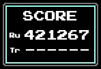 | 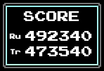 |

2 information are presented:
* Current score (as read from game itself)
* Score at transition (nor present if transition is not reached - duh!)

Note: Transition is the first level change. Starting at Level 18, a player needs to clear 130 lines before transition, starting at level 0, a player only needs to clear 10 lines till transition.


### Next

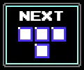

Next piece box, just like in the game

### Board

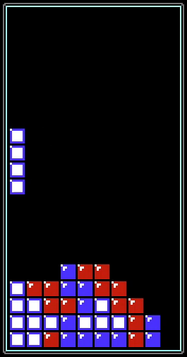

The board as read from the game itself, but redrawn for sweet sweet pixel-perfect crispness!

## I-Drought

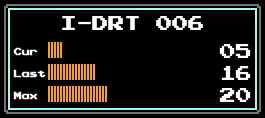

This show information about I-piece droughts:

### Header

Show number of droughts there had been in the game so far.

### Panel

Shows the following information
* Current I-drought count (may be below 13, meaning not yet a drought)
* Shows the size of the last drought (number you want to look at right after you survive a long drought)
* Shows the longest drought that was experienced in the game

When the current drought is above 13, the number blinks in red.

### Standard Metrics

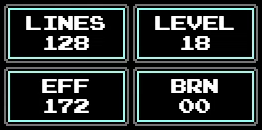

### LINES

As read from Game itself.

### LEVEL

As read from game itself.

### Efficiency (EFF)

The score per lines ignoring the level multiplier. Individual clears have score per lines of: 40 for a single, 50 for a double, 100 for a triple, 300 for a tetris

Definition from [TAUS (Tetris - Actually Useful Statistics) rom](https://www.romhacking.net/hacks/4646/) released by talented programmer [Ejona](https://github.com/ejona86), who is also the author of the awesome [2 player mod](https://www.romhacking.net/hacks/5076/)!

### BRN

How many line clears since the last tetris.


## Tetris Rate

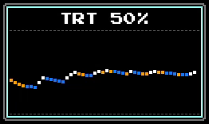

This shows the tetris rate with the same value as what is computed in the Lines box. It also shows the running Tetris rate based on the past line clear events. Each line clear event is a dot in the graph. Dots are color coded as described at the start of the document.

Just like the piece distribution, das, and height section, this graph is also a timeline, BUT it is not a timeline on the same timescale as the others. Line clear events are shown here as one dot each, but they are separated in time by long(-ish), non-regular periods. To see the line clear events with the correct time spacing, check the vertical bars in the HEIGHT section.

Exampe of Tetris rate showing all 4 types of line clear events:

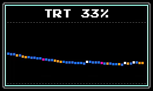


## Player Video


So you all can see me when I bang my head against the wall and cry.


## Chat

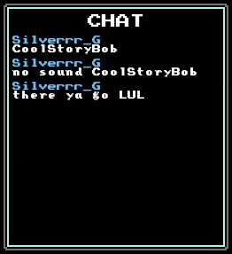

Shows the twitch chat (last few messages only, because there's no space left in the UI)

Each message shows the chatter name and the message. Each chatter is randomly assigned a color for the session, and the chatter name will be displayed in that color.


## Miscellanous notes

### Evenness Metrics

For refresher, the formula I used for eveness is this:


Why this formula? Why ratios rather than counts?

I thought having ratios would help having the 3 metrics in the same unit.

#### Reference for the formula:

This was generated from this [latex equation renderer](http://atomurl.net/math/) from the following Latex fomula:
```
100 * \sqrt{(\sum_{piece type} (\frac{count_{piece type}}{count_{allpieces}} - \frac{1}{7} )^2) / 7}
```

#### Javascript function

```javascript
function evenness(piece_counts) {
	const total_pieces = piece_counts.reduce((sum, num) => sum + num, 0);
	const deviation_sum = piece_counts.reduce((sum, num) => sum + Math.pow(num/total_pieces - 1/7, 2), 0);

	return 100 * Math.sqrt( deviation_sum / 7);
}

````


### Disclaimer

I don't know if "evenness" makes sense as a metric. I was looking for a single number that would represent whether the game, or a section thereof, was "easy" or "hard" (especialy "useful" to look at right when I die so I can blame RNG instead of just my poor skills)

Basically there are 2 kinds of metrics and stats:
* stats about the game itself, over which the player has no control, piece distribution being the main one
* stats about skills (control of DAS, stacking, spin, tucks, etc.)

While I can show the piece distribution over an extended period of time to get a visual sense of a given game's difficulty, I was looking for a single number, sort of like the [unix load average](http://www.brendangregg.com/blog/2017-08-08/linux-load-averages.html) (which also shows independent time frames (last 1min, 5mins, 15mins) to get a sense of how a server is doing).


### Chat and Text-to-Speech

I typically do not read chat during a streaming session, messages are read to me during by my custom Text-to-Speech system, which uses the [Google Cloud Voices API](https://cloud.google.com/text-to-speech), and I answer by talking back.

Just like for the user color, each chatter is randomly assigned a voice that he/she keeps for the whole session.

The voices are picked from the following selection of Google Voices. Do not complain about what voice you get!

```javascript
[
	'en-AU-Wavenet-A',
	'en-AU-Wavenet-B',
	'en-AU-Wavenet-C',
	'en-AU-Wavenet-D',

	'en-GB-Wavenet-A',
	'en-GB-Wavenet-B',
	'en-GB-Wavenet-C',
	'en-GB-Wavenet-D',

	'en-IN-Wavenet-A',
	'en-IN-Wavenet-B',
	'en-IN-Wavenet-C',
	'en-IN-Wavenet-D',

	'en-US-Wavenet-A',
	'en-US-Wavenet-B',
	'en-US-Wavenet-C',
	'en-US-Wavenet-D',
	'en-US-Wavenet-E',
	'en-US-Wavenet-F',
]
```

I **can** permanently assign a voice to a twitch user, but you need to be a regular visitor for this to happen. So far only one twitch player has that priviledge (beside myself of course), [Puffy](https://www.twitch.tv/puffie_)!

