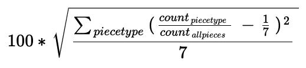
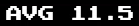
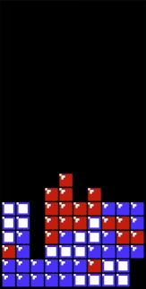
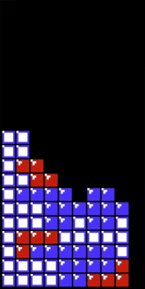
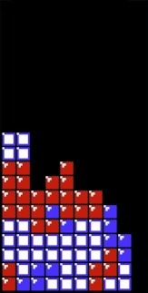
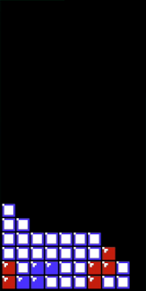
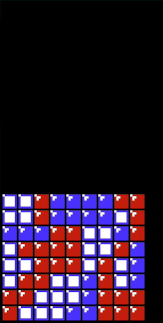
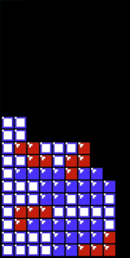

As of 2020-07-13, this is the view of the Stats UI


Many stats are self-explanatory, but nevertheless, this document will go over each.

# Background Info

## Classic NES Tetris

If you don't know anything about Classic NES Tetris, watch [this amazing video](https://www.youtube.com/watch?v=9RaqVGzhQTM) first.

## OCR, Stats, and Rerendering

Classic Tetris on NES runs on very limited real estate (good old 8bit retro game!). The only stats the original game shows are the piece counts for a particular game.

Talented developpers have built [many rom mods](https://www.romhacking.net/games/940/) to add informational stats to the in game display (e.g. tetris rate, efficiency, das value, tap speed, etc.) to address the wants of players seeking to improve various aspects of their skills.

Sadly the real estate is too limiting to add many stats. But in today's system with HD resolution, there are plenty of pixels to use. So instead of modifying the game, one might read the game information from the game frames, infer the game state from them, and recompute many stats which can all be displayed in a richer UI (*cough* crowded UI? Cluttered UI? 😅 *cough*). This is what this project is strying to do.

To read the game frames, I use the fantastic OCR software [NESTrisOCR](https://github.com/alex-ong/NESTrisOCR) written by [Alex-Ong](https://www.twitch.tv/xeal337).

While most information (like board height, line-clears, tetris rate etc.) can be derived from the original game's display, info about DAS is not available. As a DAS player, I wanted it, so to power this Stats UI, I run all my games from the wonderful [Das Trainer rom mod](https://www.romhacking.net/hacks/3761/) made by [JazzThief81](https://www.twitch.tv/jazzthief81).

The UI renders both the stats and the board itself, with crisp pixel perfect accuracy.


## Current player

The Stats UI runs for a given player (defaults to "TIM" - me!). Each completed game is recorded in a local sqlite3 database for that user. The name of the user is displayed in the PBs and High Scores Sections.


## Tetris piece randomization and droughts

Any piece in Tetris can experience a "drought", which is a sequence of pieces where that given piece doesn't come out.

In modern Tetrises with bag randomization, the longest a drought can be is 12 pieces, which occurs when, in 2 consecutive bags of 7 pieces, a given piece type is both the first of the first bag, and the last of the second bag.

For example, below is an example of the longest possible T drought in modern tetrises:

```
Bag 1: T L I S O J Z
Bag 2: I S Z J O L T
````

Classic NES tetris [doesn't use bag randomization](https://simon.lc/the-history-of-tetris-randomizers). And because of that, a drought may have arbitrary length, and be difficult for a player to handle. To contrast with modern tetrises, a game is considered in a drought in NES Classic Tetris whenever there is a sequence **13-long** or more, where a given piece does not come.

Traditionnaly, Classic Tetris players, viewers, and commentators have been focusing on I piece droughts, considered the most important because Tetrises can only be achieved with I pieces. This Stats UI however shows droughts for all pieces!


## Color-coding

Sereal components of the StatsUI include information about line-clear events. Line-clear events are color-coded as followed:

*  `#1678FF`  for Singles
*  `#FF9F00`  for Doubles
*  `#FF00B9` for Triples
*  `#FFFFFF` for Tetrises (i.e. White!)


# UI Sections

## PBs


Level 18 and 19 start PBs for the current player (retrieved from DB).

PBs are reported on score alone, not on number of lines


## High Scores


Reports the top 5 high scores for the current player in 2 sections:
* For the day
* Overall


## Lines


Shows stats about lines cleared, by type of line clears. Contains 4 type of information:

* total number of lines clear (as read from the game UI)
* for each type of line clear, shows:
    * number of line clear events for that type
    * number of lines cleared for that type
    * percentage of lines cleared for that type overall (Note: The percentage for tetrises is the "famous" tetris rate)


## Points


Shows point stats for the game in 3 types of information:

* current score for the whole game (as read from the game UI)
* For each point line clear type, shows the points generated and the percentage contribution of that type of line clear to the overall score
* Also shows points accumulated from soft drops (labelled "Drops")


## Pieces


This section is a little crowded with information.

### Header


Shows:
* Number of pieces played in the game 
* "Eveneness" measurement for 3 game periods
    * Last 28 pieces (4 bags) 
    * Last 56 pieces (8 bags) 
    * All game pieces 

Evenness is a metrics computed from this formula:



Which is almost identical to the [Standard Deviation](https://en.wikipedia.org/wiki/Standard_deviation), but uses ratios rather than piece counts.

### Notes on Evenness

* In modern tetrises, evenness for the *last 4 bags* and *last 8 bags* would be 0, since all pieces would have exactly a ratio of 1/7
* Even in Classic Tetris, on a sufficiently long game, the evenness of *all game pieces* should also tend to zero
* The 3 period metric can each take values within the range 0 (all pieces came out with the same count) to 35 (only one piece came out from a given sequence)

As shown in the sample values below:

```javascript
// 28 pieces (4 bags), perfect evenness
evenness([4, 4, 4, 4, 4, 4, 4]); // 0

// 28 pieces (4 bags), okay-ish distribution
evenness([4, 6, 2, 1, 7, 5, 3]); // ~7.1

// 28 pieces (4 bags), worst possible distribution (only single piece released)
evenness([28, 0, 0, 0, 0, 0, 0]); // ~35.0

// 28 pieces (4 bags), very even ... except for a drought
evenness([0, 4, 5, 5, 4, 5, 5]); // ~6.0

```

Note that evenness does not convey precise information, it's only a general comparative metric. As in, a value of `2` would tell you it was "reasonnably even", while a value of `9` would tell you "something weird was happening", but you'd still have to inspect the distribution to know what exactly.

For more information abour this metric, see the Miscellaneous section at the end of this document.


### Distribution matrix


The second thing the piece section is the distribution matrix, which is crammed with information. There are 7 rows, one for each piece type, with the following information in each row:

* Piece type (colored based on the level)
* Number of pieces released for that type
* Overall distribution of that piece in the game
* Visual representation for the piece distribution within a timeline of the last 120 pieces
    * Each dot represent when the piece spawned
    * Dots are color-coded based on the DAS value the piece had when it spawned (see section on DAS below)
    * If the piece experiences a drought, a continuous bar will be displayed (in grey for all piece types, except for I pieces, where droughts are displayed in orange)
* Current drought counter for the piece type

## DAS


### Header

The following informations are presented:
* Instant DAS value with gauge 
* Average DAS value from when pieces spawned (newbies will get a number below 10, average player 10-12, experts above 14) 
* 3 counters 
    * Number of pieces where spawn DAS was below 10 and below (red heart)
    * Number of pieces where spawn DAS was between 10 and 14 (both inclusive) (orange heart)
    * Number of pieces where spawn DAS was 15 or 16 (green heart)

### Matrix

The second section represents a timeline of piece spawning (just like the matrix in the Piece section above). Each column represents one piece spawning. Approximately the last 150 pieces are presented.

Within each column, the piece spwaning is represented by a dot. The DAS value for the dot is represented by both its height in the column (full DAS on top, empty DAS at bottom), and its color (red, orange, green).

Additionally, each time DAS is lost (falls to 0 when moving pieces, a dim red vertical bar is displayed).

The resulting display can be considered a "signature" of the player skills at controlling DAS.


#### Sample DAS signatures

* Average DAS player (myself - losing DAS a lot)


* Expert DAS player (my son Tristan - almost never losing DAS)


## Height and State


This section is yet another timeline. It is perfectly aligned with the DAS timeline above.

### Header

The header conly contains the color-coded legend of the information provided. 4 states are being tracked:
* Is board tetris-ready?
* Is board in a perfect slope? (decreasing or equal height from left to right)
* Is board in a double-well? (double well can only be true if player is also tetris ready on the right)
* Is player in a I-piece drought?

See this [video from Jonas Neubauer](https://www.youtube.com/watch?v=2vtyX0lkt7o) from more information about the double well.

### Matrix

The timeline represents the height of the board at a specific point in time.

The states of the board are represented as continuous lines of the appropriate colors below the graph.

Additionally, each line-clear event is represented as a vertical line of the color of that line-clear type.

Sample board with their states as computed by the Stats UI:

| sample | sample | sample |
| :-: | :-: | :-: |
|  |  |  |
| **nothing** | Tetris Ready | Tetris Ready |
|  |  |  |
| Tetris Ready | Tetris Ready<br>Double Well | Tetris Ready<br>Double Well |
|  |  |  |
| Perfect Slope | "Perfect" Slope<br>Tetris Ready | Perfect Slope<br>Tetris Ready<br>Double Well |


### Notes

Observe the sample graphs, you can see whether periods of tetris-readiness (purple horizontal marker) are ended with a Tetris (vertical white line).

You can also observe whether an extended period of tetris readiness in a drought "sees" many non-Tetris line-clear events, as the player is burning, while maintaining his/her tetris readiness.


## Score

 

2 information are presented:
* Current score (as read from game itself)
* Score at transition (nor present if transition is not reached - duh!)

Note: Transition is the first level change. Starting at Level 18, a player needs to clear 130 lines before transition, starting at level 0, a player only needs to clear 10 lines till transition.


### Next


Next piece box, just like in the game

### Board


The board as read from the game itself, but redrawn for sweet sweet pixel-perfect crispness!

## I-Drought


This show information about I-piece droughts:

### Header

Show number of droughts there had been in the game so far.

### Panel

Shows the following information
* Current I-drought count (may be below 13, meaning not yet a drought)
* Shows the size of the last drought (number you want to look at right after you survive a long drought)
* Shows the longest drought that was experienced in the game

When the current drought is above 13, the number blinks in red.

### Standard Metrics


### LINES

As read from Game itself.

### LEVEL

As read from game itself.

### Efficiency (EFF)

The score per lines ignoring the level multiplier. Individual clears have score per lines of: 40 for a single, 50 for a double, 100 for a triple, 300 for a tetris

Definition from [TAUS (Tetris - Actually Useful Statistics) rom](https://www.romhacking.net/hacks/4646/) released by talented programmer [Ejona](https://github.com/ejona86), who is also the author of the awesome [2 player mod](https://www.romhacking.net/hacks/5076/)!

### BRN

How many line clears since the last tetris.


## Tetris Rate

 

This shows the tetris rate with the same value as what is computed in the Lines box. It also shows the running Tetris rate based on the past line clear events. Each line clear event is a dot in the graph. Dots are color-coded by line-clear type, as described at the start of the document.

Just like the piece distribution, DAS, and Height section, this graph is a timeline, BUT it is not a timeline on the same timescale as the others. Line-clear events are shown here as one dot each, but they are separated in time by long(-ish), non-regular intervals. To see the line clear events with the correct time spacing, check the vertical bars in the Height section.


## Player Video


So you all can see me when I bang my head against the wall and cry.


## Chat


Shows the twitch chat (last few messages only, because there's no space left in the UI)

Each message shows the chatter name and the message. Each chatter is randomly assigned a color for the session, and the chatter name will be displayed in that color.


# Miscellanous notes

## Evenness Metric

For refresher, the formula I used for eveness is this:


Why this formula? Why ratios rather than counts?

I thought having ratios would help having the 3 metrics in the same unit.

### Reference for the formula

The formula graphic was generated with this [latex equation renderer](http://atomurl.net/math/) from the following Latex fomula:
```
100 * \sqrt{(\sum_{piece type} (\frac{count_{piece type}}{count_{allpieces}} - \frac{1}{7} )^2) / 7}
```

### Javascript function

```javascript
function evenness(piece_counts) {
	const total_pieces = piece_counts.reduce((sum, num) => sum + num, 0);
	const deviation_sum = piece_counts.reduce((sum, num) => sum + Math.pow(num/total_pieces - 1/7, 2), 0);

	return 100 * Math.sqrt( deviation_sum / 7);
}

````


### Disclaimer

I don't really know if "evenness" makes sense as a metric. I wanted to compute a single number that would represent whether the game, or a section thereof, was "easy" or "hard" (especialy "useful" to look at right when I die so I can blame RNG instead of just my poor skills)

Basically there are 2 kinds of metrics and stats:
* stats about the game itself, over which the player has no control, piece distribution being the main one
* stats about skills (control of DAS, stacking, spin, tucks, etc.)

While the stats UI can show the piece distribution over an extended period of time, to get a visual sense of a given game's difficulty, I was looking for a single number, sort of like the [unix load average](http://www.brendangregg.com/blog/2017-08-08/linux-load-averages.html) (which also shows independent time frames (last 1min, 5mins, 15mins) to get a sense of how a server is doing).


## Chat and Text-to-Speech

I typically do not read chat during a streaming session, messages are read to me by my custom Text-to-Speech system, which uses the [Google Cloud Voices API](https://cloud.google.com/text-to-speech), and I answer by talking back.

Just like for the user color, each chatter is randomly assigned a voice that he/she keeps for the whole session.

The voices are picked from the following selection of Google Voices. Do not complain about what voice you get!

```
en-AU-Wavenet-A
en-AU-Wavenet-B
en-AU-Wavenet-C
en-AU-Wavenet-D

en-GB-Wavenet-A
en-GB-Wavenet-B
en-GB-Wavenet-C
en-GB-Wavenet-D

en-IN-Wavenet-A
en-IN-Wavenet-B
en-IN-Wavenet-C
en-IN-Wavenet-D

en-US-Wavenet-A
en-US-Wavenet-B
en-US-Wavenet-C
en-US-Wavenet-D
en-US-Wavenet-E
en-US-Wavenet-F
```

I **can** permanently assign a voice to a twitch user, but you need to be a regular visitor for this to happen. So far only one twitch player has that priviledge (beside myself of course), [Puffy](https://www.twitch.tv/puffie_)!

